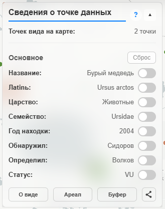
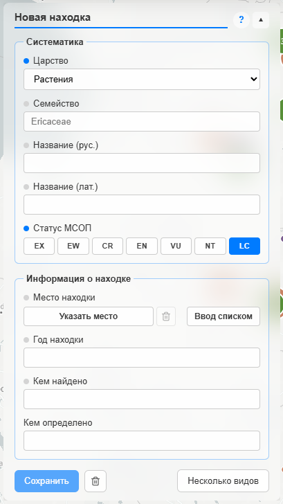
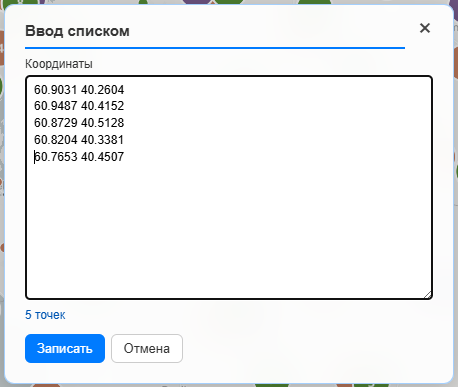

# Справка по модулям Flora

Подробные инструкции по работе с панелями и инструментами карты.

## feature

**О точке**

Панель открывается после клика на любой точке на карте. Если открыть панель, не указав никакую точку, она будет пустой с предолжением выбрать точку на карте.

Панель содержит основную информацию о находке: название вида (на русском и латыни), базовую систематику (царство и семейство), год находки, ее автора и определившего вид, а также статус вида по МСОП.

Для точек **GBIF** без русского названия в строке «Название» показывается кнопка **Найти**. По клику приложение ищет соответствие в локальном каталоге, GBIF Species API и Wikidata. Найденные названия хранятся отдельно от выгрузки GBIF (overlay-словарь) и не теряются при повторной загрузке или обновлении точек.

Каждому пункту соответствует переключатель, включающий фильтрацию точек на карте по данному значению: на карте будут отображаться только точки с аналогичным свойством.

Кнопка **Сброс** убирает фильтры, связанные с текущей точкой. Статус вида (МСОП) фильтруется отдельно в модуле «Статус МСОП».

Кнопка **Радиус** открывает инструмент построения возможной зоны распространения вида (максимум — 15 км) для оценки возможных мест нахождения вида. Панель «Сведения о точке» при этом остаётся открытой — радиус показывается под ней.

Кнопка **Буфер** открывает инструмент построения буферных зон для оценки вероятности нахождения вида в заданных радиусах от места находки. Аналогично радиусу, панель точки не закрывается.

Инструменты «Буфер» и «Радиус» аналогичны тем, которые вызываются из главного меню.

## areal

Инструмент **Радиус** создаёт вокруг выбранной точки (или всех видимых точек) окружность заданного радиуса, в которой вероятна еще одна находка.

Это не точная оценка, а область вероятного распространения, которую устанавливаете вы.

- **Установить радиус** — круг заданного радиуса вокруг выбранной точки (если точка находится в кластере, радиус для неё не строится).
- **Ко всем видимым маркерам** — выполняется построение для всех отображаемых точек.
- **Радиус** задаётся слайдером в километрах с шагом в 0,1 км.

Если в построенную окружность попадают другие точки, их список выводится ниже. Кликом по нужному пункту списка центрирует карту на соответствующей точке.

Для работы модуля из меню нужна выбранная точка на карте.

## polygon

Модуль **Полигон** строит область по всем точкам **того же вида**, что и выбранная находка. Вид определяется по латинскому названию.

Это **экспериментальная функция**, она может работать некорректно. Пожалуйста, проверяйте результат.

### Открытие и выбор точки

Модуль **Полигон** доступен в меню без предварительного выбора точки. Пока точка не выделена, в панели отображается подсказка «Выделите любую точку»; инструменты появляются после клика по маркеру.

### Построение ареала

Полигон строится как **выпуклая оболочка** по всем точкам вида в наборе данных. Для одной или двух точек вместо оболочки рисуется небольшая буферная область.

- **Построить** — выпуклая оболочка для вида текущей точки.
- Иконка **пятиугольника / звезды** — переключение между выпуклой оболочкой и режимом **«Все точки»** (нужно не менее трёх точек вида). Звезда означает активный режим «все точки».

### Несколько ареалов

Можно построить **несколько ареалов** для разных видов:

1. Выделите точку и нажмите **Построить**.
2. Нажмите **Добавить полигон** и выберите точку другого вида на карте.
3. Повторяйте для новых видов.

Правила:

- На один вид — **один ареал**; повторное построение для того же вида обновляет полигон.
- В списке ареалы именуются «Ареал — {название вида}».
- У каждого ареала в списке: переключение режима, **Скрыть** / **Показать**, **Удалить**.
- **Сбросить всё** (иконка корзины в верхней строке) убирает все ареалы.

Список «В полигоне: N видов» показывается **только при одном** построенном ареале. При нескольких ареалах этот список скрыт.

### Клик по карте

При клике по пустому месту на карте, пока открыт модуль «Полигон», выделение точки снимается, **все ареалы убираются с карты**, панель остаётся открытой с подсказкой «Выделите любую точку».

## buffer

Модуль **Буфер** строит вокруг выбранной точки набор из трёх концентрических окружностей, радиус которых находится в созависимости:

- Наименьший радиус у красной зоны, наибольший — у зелёной.
- Радиус каждой следующей зоны не может быть меньше радиуса предыдущей.
- Максимальный радиус красной зоны — 5 км, жёлтой — 10 км, зелёной — 15 км.

Инструмент служит для построения зон оценки вероятности новой находки вида. В красной зоне находка наиболее вероятна, в зелёной — наименее.

Чтобы включить инструмент, нажмите кнопку **Построить буфер**. После включения его можно менять слайдерами зон. Кнопка **Сброс** убирает буфер с карты и сбрасывает настройки.

Для работы из главного меню нужна выбранная точка.

## area

Модуль **Область** позволяет выделить участок карты и увидеть точки, попавшие внутрь выделения.

### Инструменты

Нажмите одну из кнопок формы — рисование включится сразу. Повторное нажатие той же кнопки отменяет режим рисования.

- **Произвольная** — зажмите левую кнопку мыши и обведите контур.
- **Прямоугольник** — потяните мышью от одного угла к противоположному.
- **Полигон** — щёлкайте по карте для вершин; завершите **двойным левым кликом** или **правой кнопкой мыши** (**Esc** — отмена).

### Работа с результатом

- После завершения контура в панели появляется список точек с учётом активных фильтров.
- Клик по названию в списке перемещает карту к точке.
- **Сброс** убирает область с карты и очищает список.

## search

Панель **Поиск** фильтрует точки, уже лежащие на карте, по названию вида (латинскому или русскому).

- Введите не меньше двух символов — на карте останутся все виды, в названии которых есть эта подстрока, в панели появится список совпадений.
- Клик по виду в списке оставляет только его точки; повторный клик возвращает все совпадения запроса.
- Фильтр действует вместе с царством, годом и другими ограничениями карты. Поиск не загружает данные из сети.
- Сброс — очистка поля или угловая кнопка фильтров на карте.

## year

**Год находки** позволяет ограничить отображение точек временным диапазоном.

Включите переключатель фильтра и задайте минимальный и максимальный год с помощью двух ползунков. На карте останутся только точки, год находки которых попадает в выбранный интервал.

Если для точки уже включён фильтр по полю «found_year» в модуле **«Сведения о точке»**, фильтр по году здесь временно блокируется. Отключите фильтр по году в панели «Сведения о точке», чтобы разблокировать данный инструмент.

## status

**Статус** — фильтр по категориям Красной книги / IUCN (CR, EN, VU, LC и др.).

Отметьте один или несколько статусов — на карте останутся только соответствующие точки. Снятие всех галочек показывает весь набор данных (с учётом других активных фильтров).

## map

**Группы точек** управляют отображением точек и кластеров.

- **Кластеризовать** — включает или отключает кластеризацию близких маркеров.
- **По царству** — отдельные кластеры для растений, грибов и животных (работает только при включённой кластеризации; недоступно вместе с диаграммами).
- **Диаграммы** — показывает состав каждого кластера секторной диаграммой (растения, животные, грибы); при включении отключает группировку по царству.
- **Плотные группы** — вместо обычной кластеризации показывает только группы ≥10 точек с полностью одинаковыми координатами; **Обработка** открывает отдельную панель.
- **Показывать маркеры** — скрывает или показывает точки на карте.
- **Тепловая карта** — вместо маркеров отображает плотность находок; учитывает текущие фильтры.

Угловая кнопка фильтра на карте **сбрасывает** все активные фильтры (свойства точки, статус, год, «Только эти» у инструментов, режим плотных групп). Если фильтров нет, кнопка недоступна.

## dense

Панель **Обработка плотных групп** открывается кнопкой **Обработка** в «Группы точек» и скрывает остальные панели модуля.

- На карте остаются только группы с полностью одинаковыми координатами; порог числа точек задаётся ползунком (по умолчанию ≥10); остальные точки скрыты.
- **Список** — перечень групп и число точек в каждой; клик по строке раскрывает группу и зумирует к её точкам.
- Клик по оранжевому маркеру плотной группы тоже раскрывает её.
- Угловая кнопка фильтра на карте сбрасывает и этот режим.

## oopt

Модуль **ООПТ** показывает на карте границы особо охраняемых природных территорий и заповедников.

- Переключатели слоёв включают или выключают соответствующие полигоны (данные загружаются из Firestore).
- **Маркеры** — общий переключатель видимости всех точек находок на карте в этом модуле.
- Клик по полигону на карте выбирает территорию и открывает панель **Сведения об ООПТ** справа от основной панели.

## oopt-feature

Панель **Сведения об ООПТ** открывается после выбора полигона на карте.

- В заголовке — название территории и её атрибуты (категория, площадь и другие поля слоя).
- Строка **«Внутри точек — N, видов — M»** показывает количество точек находок и уникальных видов внутри полигона с учётом активных фильтров карты.
- Иконка **списка** открывает панель **«Виды внутри выбранной ООПТ»**; повторное нажатие скрывает её. В списке доступна группировка по царству (дерево «царство → семейство → вид»); клик по виду центрирует карту на соответствующей точке.
- Кнопка **«Только эти»** (иконка фильтра) показывает или скрывает маркеры только внутри выбранного полигона. Если переключатель **Маркеры** в панели ООПТ выключен, фильтр временно показывает точки внутри территории, не включая все остальные маркеры на карте. Сброс этого и остальных фильтров карты — угловая кнопка фильтра.

## submit

Модуль **Ввод данных о находке** предоставляет инструменты для ввода новых находок.
Точки, созданные пользователями, хранятся в отдельной базе данных, так как нуждаются в последующей верификации.

---

Откройте окно ввода информации о новой точке нахождения вида и заполните все предложенные поля (поле **Кем определено** не является обязательным, но информация об определившем вид желательна).

Обратите внимание, что обязательные поля отмечены маркером слева. Если поле не заполнено, маркер будет серым. Когда же поле заполнено, маркер становится синим.

Перед тем, как нажать кнопку **Сохранить**, убедитесь, что все поля заполнены правильно, перезаписать вашу точку будет невозможно.

Указывайте латинское название семейства. Латинское название вида указывайте без литеры автора. При вводе второй точки того же вида семейство будет предложено автозаполнение поля с выбором из уже внесенных в базу вариантов.

Чтобы указать, где будет расположена точка данных, кликните на кнопке **Указать место** и щелкните в том месте карты, где был обнаружен вид.
Если произошла ошибка, щелкните иконку корзины рядом с кнопкой, на которой теперь указываются выбранные координаты. Координаты будут сброшены.

Для тех случаев, когда указывается **НЕСКОЛЬКО** находок **ОДНОГО** вида в **ОДИН** год **ОДНИМ** человеком предусмотрена возможность ввода координат списком.

Щелкните кнопку **Ввод списком**. Откроется окно ввода нескольких пар координат.

Введите списком всем необходимые координаты. Разделяйте широту и долготу **пробелом**, например:

Если список координат прочитался успешно, на кнопке **Ввод списком** появится количество добавляемых точек.

Если вид с таким латинским названием уже есть в файле, добавляется только новая находка; поля вида не перезаписываются.

## data-sources

Панель **Источники данных** открывается выбором **Внешние источники** в меню «Точки» и загружает находки из GBIF и iNaturalist на **отдельные** слои карты (`gbif-locations`, `inat-locations`). Цвета маркеров — как у локальных точек, по царству.

- Данные не записываются в Firestore / `points.json`; после загрузки сохраняются в IndexedDB браузера в сжатом колоночном снимке (не сырой GeoJSON) и восстанавливаются при следующем запуске. Повторная загрузка **добавляет** точки к уже сохранённым (слияние по ID источника). Загруженные точки участвуют в фильтрах карты и инструментах наравне с локальными.
- Регион задаётся в реестре (по умолчанию Вологодская область через GADM `RUS.78_1`); клиент рассчитан на добавление других регионов.
- Перед загрузкой показывается оценка числа находок. Загрузка постраничная; на карте точки появляются **только после окончания** загрузки (промежуточные страницы не рисуются); есть прогресс и отмена. Если находок GBIF больше 10 000, загрузка идёт **сериями по годам** (и при необходимости по месяцам), плюс отдельные проходы по датасетам для записей без года. Если наблюдений iNaturalist больше 10 000, загрузка выполняется **сериями** (по группам таксонов и при необходимости по годам). Для iNaturalist можно выбрать качество наблюдений: research grade, casual или оба.
- После загрузки карта, фильтры, инструменты и popup используют только локальную копию; к внешним API обращаются только кнопки «Загрузить» и «Обновить».
- Режим **Внешние источники** в меню «Точки» скрывает локальные маркеры и тепловую карту, оставляя на карте слои внешних источников; при выборе другого источника восстанавливается прежняя видимость.
- Кнопка **Обработка данных** открывает панель клиентских фильтров загруженных слоёв (см. ниже).
- Кнопка **Фильтр регионов** (рядом с **Загрузить регионы**) скрывает или показывает точки выбранных субъектов РФ на карте, не удаляя их из локальной копии.
- Кнопка **Фильтр регионов** (рядом с **Загрузить регионы**) скрывает или показывает точки выбранных субъектов РФ на карте, не удаляя их из локальной копии.

## external-processing

Панель **Обработка внешних данных** открывается из панели **Источники данных** и сворачивает её (взаимно, как у плотных групп и сведений о точке).

- **Источник** — GBIF / iNaturalist / оба.
- **Царство** — Все / растения / животные / грибы / простейшие (`regnum`).
- **Семейство** и **поиск по латыни** — подстрока без учёта регистра по полям `family` и `name_latin`.
- Фильтры действуют только на отображение слоёв и выборку для инструментов; снимок в IndexedDB не меняется. Сброс фильтров — кнопкой в панели или общим сбросом фильтров на карте.

## data-work

**Работа с данными** — инструмент из меню **Инструменты**. Хаб со списком операций над данными; выбранный пункт открывается в отдельном окне.

**Близкие точки** — таблица пар GBIF ↔ iNaturalist с одинаковым латинским названием (без учёта регистра) в радиусе порога близости (0–50 м, по умолчанию 50 м). Для каждой пары: источник, название вида и координаты обеих точек плюс расстояние в метрах. Выборки берутся из уже загруженных слоёв с учётом фильтров **Обработки внешних данных**. Оба слоя должны быть загружены. **Объединить** пишет документ в Firestore-коллекцию `merged_points` (координаты — середина пары, в записи — `merged_from` со ссылками на исходники), добавляет точку на слой **Слитые точки** и скрывает исходные ключи через фильтр скрытых точек. Тумблер слоя — в панели **Группы точек**.

**Без атрибуции** — таблица точек всех видимых слоёв (локальные, GBIF, iNaturalist), у которых отсутствует хотя бы одно из полей: царство (`regnum`), семейство (`family`), латинское название (`name_latin`), год находки (`found_year`). Учитываются фильтры карты и обработки внешних данных. Клик по строке открывает окно заполнения только пустых полей; **Сохранить** пишет документ в Firestore-коллекцию `point_attributions` и накладывает атрибуты на точку на карте. Иконка глаза **скрывает** точку; в списке активных фильтров появляется **Скрытые точки (N)**.

## gbif

Устаревшее имя раздела: см. **Источники данных** (`data-sources`). Ранее панель называлась **Данные GBIF** и загружала только occurrences GBIF.

## gbif-processing

Устаревшее имя раздела: см. **Обработка внешних данных** (`external-processing`). Ранее панель называлась **Обработка данных GBIF**.

## redbook

**Поиск редких видов** — загрузите список латинских названий (TXT/JSON), при необходимости со статусом (`EN`, `VU`…; без статуса — `None`). **Найти в GBIF / iNat** собирает совпадения среди уже загруженных внешних точек в отдельный слой **Красная книга**. Список и совпадения пока хранятся локально (JSON / localStorage).
